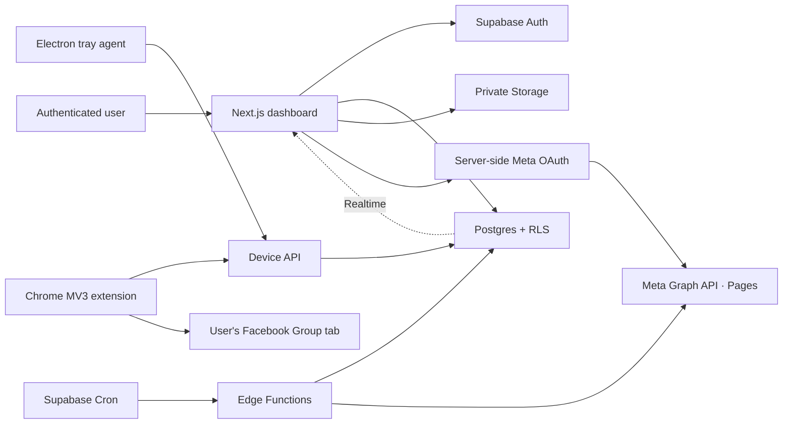

# Architecture

Each destination produces exactly one `post_destinations` row and one `publishing_jobs` row. A unique constraint on `post_destination_id` plus a SHA-256 idempotency key prevents duplicate jobs. Page jobs are published by a server-only Edge Function. Group jobs are atomically claimed with `FOR UPDATE SKIP LOCKED`, leased to one registered device, and completed by the local extension.

The core relationship is organisation → campaign/content/destination → post → post destination → publishing job → attempts. Organisations and users are many-to-many through `organisation_members`. Every tenant table carries `organisation_id`; RLS checks membership and roles. Media object paths start with the organisation UUID so Storage policies use the same boundary.

Browser agents do not communicate directly with Electron. Both publish authenticated device heartbeats through Supabase. This avoids local ports, firewall prompts, and cross-process trust. Unfinished leases expire and return to `ready` or `requires_attention` according to attempt limits.
